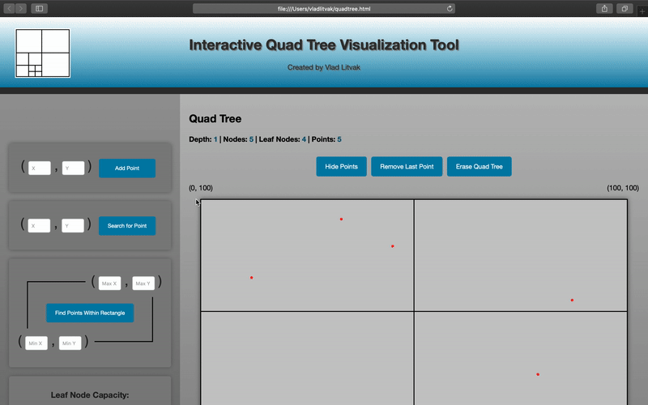

# Quad Tree Visualization Webpage

### [See Demos](#add-points)

### DESCRIPTION

- These files create a webpage that can be opened in any modern browser.
- The webpage provides a tool to visualize the Quad Tree Data Structure and see the process of adding points, searching for points, and executing range queries.
 

### FILE INFO

- [**quadtree.html**](quadtree.html) sets the layout of the webpage.
- [**style.css**](style.css) defines the style to be used in the webpage.
- [**script.js**](script.js) defines the logic and animations to be used in the webpage.
 

### PROGRAM SETUP

- Download this repo.
- Open [**quadtree.html**](quadtree.html) in any modern browser.
 
 

   
  <h2>Add Points</h2>
  
   
   
  <h2>Search For Point</h2>
  
   
   
  <h2>Range Query</h2>
  
   
   
  <h2>Toggle Node Capacity</h2>
  
   
   
  <h2>Other Functionality</h2>
  

